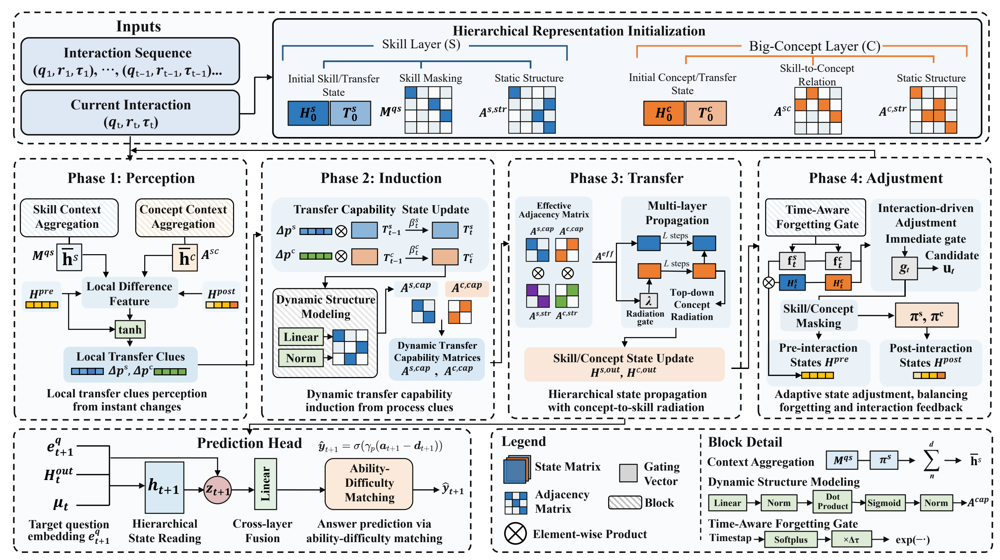

# DLTPKT

Official implementation accompanying the manuscript **DLTPKT: Interpretable
Knowledge Tracing for Dynamic Learning Transfer Process**. This repository
contains the release-oriented main experiment code on the processed
**Statics** dataset.

## Overview

Unlike interpretable knowledge tracing methods that mainly explain why a
prediction is made at a specific decision moment, DLTPKT focuses on how the
learner's cognitive states evolve throughout continuous learning. It models
dynamic learning transfer as four connected phases:

- **Perception:** identifies local transfer clues from interaction-triggered
  cognitive changes.
- **Induction:** consolidates these clues into dynamic transfer capabilities at
  the skill layer and the latent big-concept layer.
- **Transfer:** models the propagation, aggregation, and radiation of knowledge
  states along hierarchical structures.
- **Adjustment:** adaptively updates cognitive states using interaction
  feedback and time-aware forgetting effects.

This process-level interpretation chain is complemented by hierarchical
mastery readouts and ability-difficulty matching for next-response prediction.

## Framework



## Repository Structure

```text
DLTPKT/
|-- assets/framework.png
|-- checkpoints/
|   `-- DLTPKT_statics_best.pth  # legacy reference checkpoint
|-- data/statics/
|   |-- attribute/
|   |-- encode/
|   |-- graph/ques_skill.csv
|   `-- train_test/
|       |-- train_all_feature.txt
|       `-- test_all_feature.txt
|-- dltpkt/
|   |-- data.py
|   |-- metrics.py
|   `-- model.py
|-- docs/architecture.md
|-- evaluate.py
|-- requirements.txt
`-- train.py
```

## Environment

Python 3.9 or later is recommended.

```bash
python -m venv .venv
# Linux/macOS
source .venv/bin/activate
# Windows PowerShell
.venv\Scripts\Activate.ps1

pip install -r requirements.txt
```

Install a CUDA-enabled PyTorch build for GPU training. The training script
defaults to CUDA; pass `--device cpu` when running without a GPU.

## Train

```bash
python train.py
```

Useful options:

```bash
python train.py --device cuda --epochs 200 --batch-size 64
python train.py --device cpu --epochs 1 --batch-size 8
```

Training writes the best compatible checkpoint and a one-row result table to
`outputs/`.

## Evaluate

After training:

```bash
python evaluate.py
```

To evaluate another compatible checkpoint:

```bash
python evaluate.py --checkpoint path/to/DLTPKT_statics_best.pth
```
